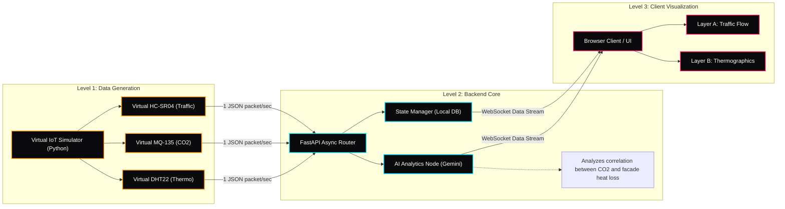

# Astana Twin: Digital Core Architecture

This document describes the 3-level technical system flowchart for raw street-level data simulation, central routing, correlation analyzing, and dashboard rendering.

## System Diagram (Left-to-Right / 3-Level Flowchart)

---

## Architectural Breakdown

### Level 1: Data Generation
- **Virtual IoT Simulator**: A background Python script generating real-time district environmental data.
- **Virtual HC-SR04 (Traffic)**: Simulates inductive loop and speed radars tracking average traffic velocities and lane congestion indexes.
- **Virtual MQ-135 (CO2)**: Simulates air quality sensor inputs measuring parts per million (PPM) of vehicle emissions.
- **Virtual DHT22 (Thermo)**: Simulates building envelopes, outputting surface heat dissipation rates (W/m²) and local ambient temperatures.

### Level 2: Backend Core
- **FastAPI Async Router**: Central routing trunk. Exposes API endpoints receiving the simulator streams, running validation schemas, and handling socket handshakes.
- **State Manager**: Maintains a localized database of building parameters, road coordinates, and rolling speed histories.
- **AI Analytics Node (Gemini 2.5 Flash)**: Correlates the rising CO2 emissions from traffic bottlenecks with building thermal envelope leaks, drafting real-time green corridor routing and structural retrofit logs.

### Level 3: Client Visualization
- **Browser Client**: A cyber-brutalist dashboard rendering dynamic street vector networks and live gauges.
- **Layer A (Traffic Flow)**: Interactive vector canvas highlighting traffic bottle-necks, congestion indicators, and signal timing corrections.
- **Layer B (Thermographics)**: Thermal audit maps showing building polygon leak thresholds, insulation upgrade payback times, and materials recommendations.
